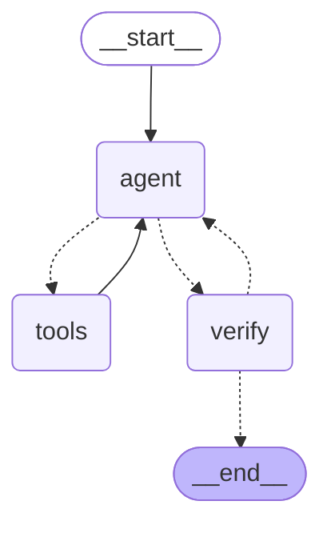

# Agentic Text-to-SQL

Ask a database questions in plain language. An LLM agent inspects the schema,
looks at real data, writes SQL, runs it, and checks its own answer before
reporting it.

This started as a fixed pipeline with a retry loop. It is now an agent: the
model decides which tools to call and in what order, and nothing in the code
prescribes that sequence.

## The problem it solves

The example database stores countries as codes: `IT`, `UK`, `CN`.

Ask *"how many Italian customers are there?"* and a naive text-to-SQL system
writes `WHERE country = 'Italy'`. The SQL is valid, SQLite raises nothing, the
query reports success — and the answer is **0**, which is wrong.

Retrying on database errors cannot catch this, because there is no error. See
it for yourself:

```bash
python main.py --compare "How many Italian customers are there?"
```

```
--- before: fixed pipeline, retries only on SQL errors ---
  SELECT COUNT(*) AS count FROM customers WHERE country = 'Italy'
  count
  0

--- after: agent that inspects the database ---
  There is 1 Italian customer (country code 'IT').

  steps taken:
    list_tables({})
    describe_table({'table': 'customers'})
    sample_rows({'table': 'customers'})
    run_select({'sql': "SELECT COUNT(*) AS italian_customers FROM customers WHERE country = 'IT';"})
```

Both runs use the same model, so the only variable is the architecture.

## Architecture

Built with [LangGraph](https://docs.langchain.com/oss/python/langgraph/). The
graph is the architecture, and it is generated from the code itself with
`python main.py --diagram`:



Three nodes and two loops:

- **agent** — the model, with the four tools bound to it. It chooses what to
  call next, or stops and proposes an answer.
- **tools** — executes the calls and returns the results, including database
  errors verbatim. The edge back to `agent` is the **self-correction loop**:
  the model sees the query it wrote and the exact error it caused.
- **verify** — reviews the proposed answer against the transcript. On rejection
  the agent goes back with the reason, up to `MAX_REVISIONS` times. This is the
  **revision loop**.

A checkpointer keeps each thread's history, so follow-up questions work:
*"and for the UK?"* reuses what the agent already learned.

### The four tools

| Tool | Purpose |
|---|---|
| `list_tables` | names of the tables |
| `describe_table` | columns, types, keys of one table |
| `sample_rows` | real rows, so filters use values that exist |
| `run_select` | run a read-only query, return rows or the exact error |

Tool descriptions are the prompt the model reads to choose between them, so
they are written as deliberately as any other code.

## Setup

Python 3.10 or newer.

```bash
python -m venv .venv
source .venv/bin/activate
pip install -r requirements.txt
cp .env.example .env
```

Put a free API key in `.env`. Two providers are supported and either works:

| Provider | Key from | Free tier |
|---|---|---|
| `groq` (default) | [console.groq.com/keys](https://console.groq.com/keys) | fast, ~8K tokens/minute |
| `gemini` | [aistudio.google.com/apikey](https://aistudio.google.com/apikey) | far more headroom |

```
LLM_PROVIDER=groq
GROQ_API_KEY=gsk_...
```

Switching provider is a change to `.env`, not to the code. `LLM_MODEL`
overrides the model if you want a specific one.

## Usage

```bash
python main.py "How many customers placed more than one order?"
python main.py                    # interactive, remembers earlier questions
python main.py --trace "..."      # show which tools were called
python main.py --compare "..."    # answer with both the old and new system
python main.py --diagram          # print the graph as mermaid
python main.py --db other.db "..."
```

## Layout

```
sql_agent/
  llm.py            provider selection
  tools.py          the four tools the agent can call
  graph.py          the LangGraph state graph
  schema_utils.py   database introspection
  db_executor.py    read-only guard and subprocess execution
  _db_worker.py     the isolated child process
legacy/
  nl2sql_agent.py   the original pipeline, kept for --compare
data/example.db
tests/
main.py
```

## Safety

The agent writes SQL on its own, so `run_select` is guarded in layers, on the
principle that no single check is perfect:

1. SQLite opens the database in `mode=ro`. Writes are refused by the engine,
   whatever the text checks conclude.
2. An allow-list on the first keyword (`SELECT` / `WITH`), evaluated after
   comments and string literals are blanked out — so `-- x\nDROP TABLE t` is
   caught, while `WHERE product = 'DROP'` is not a false positive.
3. Multiple statements are rejected, as are write verbs hidden after a `WITH`
   clause, which SQLite would otherwise accept.

Rejections state the reason, because the agent reads it and adapts.

Results are capped and flagged as truncated, so a sample is never mistaken for
a complete result and counted.

## Tests

```bash
python -m pytest tests/ -q
```

105 tests, no API key needed. The graph is exercised with a scripted model, so
approval, rejection, revision caps, thread isolation and SQL self-correction
are all verified offline and deterministically.
